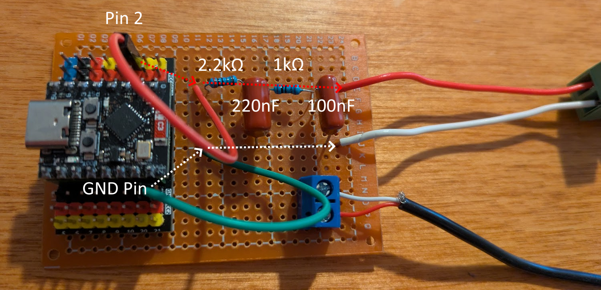
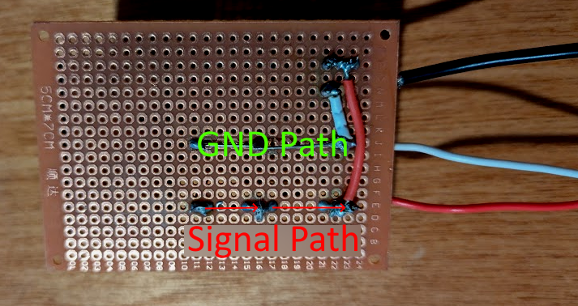

# ESP32-C3 Guitar Tone Generator

Audio signal generator designed specifically for testing guitar effects pedals and audio equipment. Built on the ESP32-C3 microcontroller with serial control interface.

## Features

- **Four Waveform Types**: Sine, Square, Triangle, and Sawtooth waves
- **Guitar-Optimized Frequency Range**: 20Hz to 5kHz with 0.1Hz precision
- **Serial Control Interface**: Simple text commands for automation and manual control
- **Guitar Note Presets**: Instant access to standard guitar tuning frequencies
- **Real-Time Parameter Adjustment**: Frequency, amplitude, and waveform control
- **Professional Audio Output**: Line-level output suitable for guitar effect inputs
- **Frequency Sweep Function**: Automated testing for frequency response analysis

## Hardware Requirements

- Any ESP32-C3 compatible development board
- (Optional) Breakout GPIO board
- Perfboard
- GPIO wires
- R1: 2.2kΩ resistor (1/4W)
- R2: 1kΩ resistor (1/4W)  
- C1: 220nF ceramic capacitor
- C2: 100nF ceramic capacitor
- Bare wire to 1/4 audio jack modular connector
- (Optional) 2x Block Terminal

### Top View


We've assembled the output circuit on regular perfboard. It's a simple signal path which begins with stripping the opposite ends of two female GPIO wires and soldering them to a point on the board. The red wire connects to GPIO pin 2, and the green wire to GND. 

Our ground path is built by simply bending the legs of the capacitors to create a continuous line. The signal path flows through the resistors and drains to ground via the capacitors as follows: 

The system uses a two-stage low-pass filter to convert 80kHz PWM to smooth analog audio.

1. **Stage 1**: 2.2kΩ + 220nF (fc ≈ 3.3kHz) - Removes PWM switching noise
2. **Stage 2**: 1kΩ + 100nF (fc ≈ 1.6kHz) - Final smoothing

### Audio Output Circuit
```
ESP32 GPIO2 → 2.2kΩ → 220nF → 1kΩ → 100nF →  Audio Output
              (R1)    (C1)   (R2)    (C2)    (1/4" Jack)
                       ↓       ↓       ↓
                      GND     GND     GND
```

(the output leg also includes a 2-terminal block wired directly to the output to accomadate other signal output tip styles.)

### Bottom View



## Technical Specifications

| Parameter | Value | Notes |
|-----------|-------|-------|
| Output Frequency | 20Hz - 5000Hz | Covers guitar fundamentals and harmonics |
| Frequency Resolution | 0.1Hz | High precision tuning |
| Amplitude Control | 0% - 100% | Variable output level |
| Output Level | ~1.5V p-p | Line level, guitar pedal compatible |
| Sample Rate | 40kHz | PWM conversion rate |
| PWM Frequency | 80kHz | Well above audio range |
| THD (Sine wave) | <0.5% | After analog filtering |


## Usage

### Serial Interface
Connect via serial monitor at **115200 baud** for control interface.

### Basic Commands
```
help                  - Show all available commands
status               - Display current generator settings
on / start           - Enable audio generation
off / stop           - Disable audio generation
```

### Frequency Control
```
freq 440             - Set frequency to 440Hz
f 440                - Short form frequency command
tune 0.5             - Fine-tune frequency by +0.5Hz
tune -1.0            - Fine-tune frequency by -1.0Hz
```

### Waveform Selection
```
wave sine            - Select sine wave (pure tone)
wave square          - Select square wave (rich harmonics)  
wave triangle        - Select triangle wave (moderate harmonics)
wave sawtooth        - Select sawtooth wave (bright harmonics)
w square             - Short form waveform command
```

### Amplitude Control
```
amp 75               - Set amplitude to 75%
a 50                 - Short form amplitude command (50%)
```

### Guitar Note Presets
```
notes                - List all available guitar note presets
note e2              - Set to low E string frequency (82.4Hz)
note a4              - Set to A440 reference frequency
note g3              - Set to G string frequency (196Hz)
```

**Available Presets:**
- E2: 82.4Hz (Low E, 6th string)
- A2: 110.0Hz (A, 5th string)
- D3: 146.8Hz (D, 4th string)  
- G3: 196.0Hz (G, 3rd string)
- B3: 246.9Hz (B, 2nd string)
- E4: 329.6Hz (High E, 1st string)
- A4: 440.0Hz (A440 reference)
- C5: 523.3Hz (High C)
- TEST: 1000.0Hz (1kHz test tone)

### Frequency Sweep Testing
```
> sweep
Execute 100Hz to 1000Hz sweep over 10 seconds
```


## Future Plans

- **SD Card Audio Output**: Add SPI SD card with pre-recorded tracks for music testing
